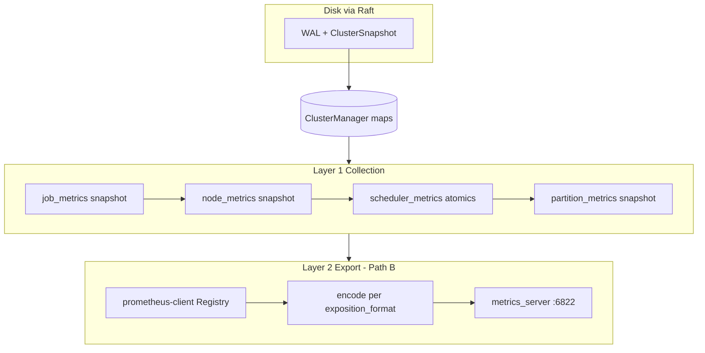
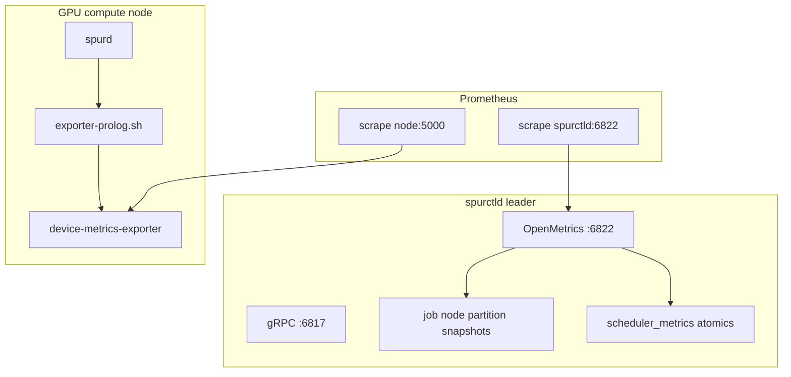

# Phase 14.1: Prometheus / OpenMetrics Metrics

Design plan for [implementation-roadmap.md](implementation-roadmap.md) §14.1.

**Status:** Layer 1a jobs done (PR #212). **Layer 2 jobs export done** (Path B: `prometheus-client`, dual `exposition_format`, goldens). Node/scheduler/partition collection + real gauges deferred to follow-up PRs; stub routes return empty exposition on leader.

## Build strategy: collect, then export

Work proceeds in **two layers**. Do not ship HTTP/OpenMetrics until the corresponding **in-memory aggregates** exist and stay consistent with cluster state.

| Layer | What | When |
|-------|------|------|
| **1 — Collection & retention** | Derived metric snapshots in spurctld memory; durable source of truth on disk via existing Raft job/node state (and optional rebuild on restore) | **First** |
| **2 — Export** | OpenMetrics encoding + HTTP on `:6822`, Prometheus/Grafana docs, AMD deploy hooks | **After** layer 1 for each domain |

Within **layer 1**, implement in this order:

1. **Job metrics** — `JobMetricsSnapshot` from `ClusterManager::jobs`
2. **Node metrics** — from `nodes` + heartbeats
3. **Scheduler metrics** — atomics in `scheduler_loop.rs`
4. **Partition metrics** — rollups from partitions, nodes, jobs

Within **layer 2**, mirror the same order (export `/metrics/jobs` before `/metrics/nodes`, etc.).



## Implementation checklist

### Layer 1 — Collection (in order)

- [x] **1a Job** — `crates/spur-metrics/src/job.rs`: `JobMetricsSnapshot`, `collect()`; `ClusterManager::job_metrics()` lazy scan of `jobs` (merged in PR #212)
- [ ] **1b Node** — `NodeMetricsSnapshot` + refresh hooks on node register/update/heartbeat/state
- [ ] **1c Scheduler** — `SchedulerMetrics` atomics in `scheduler_loop.rs`
- [ ] **1d Partition** — `PartitionMetricsSnapshot` + refresh when jobs/nodes/partitions change

### Layer 2 — Export (Path B — prometheus-client greenfield)

**Decision:** Path B — discard PR #217 hand-rolled export (`openmetrics.rs`, hand-rolled `encode_job_metrics`); implement export with [`prometheus-client`](https://docs.rs/prometheus-client) only.

**Jobs export (this PR):**

- [x] `[metrics]` listen/bind + `metrics_server.rs` routes + leader 503
- [x] Remove hand-rolled `openmetrics.rs`, `job_export.rs`, `job_metrics.prom`
- [x] `prometheus-client` workspace dep + `export/` layout (`jobs` + stub `nodes` / `scheduler` / `partitions`)
- [x] `exposition_format` — `slurm_0_0_4` (default) | `openmetrics_1_0`; `encode_registry` / strict `encode` + `# EOF`
- [x] `register_jobs` + `encode_job_metrics_with_format` + goldens (`tests/fixtures/jobs.*.prom`)
- [x] `metrics_server` uses `MetricsExpositionFormat` for `Content-Type` + body on `/metrics` and `/metrics/jobs`
- [x] Stub `/metrics/nodes`, `/metrics/partitions`, `/metrics/scheduler` (200 + empty body on leader; real gauges in follow-up)

**Deferred (follow-up PRs):**

- [ ] **1b–1d collection** — `NodeMetricsSnapshot`, `SchedulerMetrics`, `PartitionMetricsSnapshot` + populate stub exporters
- [ ] **`/metrics/jobs-users-accts`** — high-cardinality per user/account (opt-in via `high_cardinality`; route returns 404 until implemented)
- [ ] K8s manifests (port 6822), `deploy/metrics/` AMD hooks, `spur-k8s` health.rs, bare-metal E2E

## Goals

- Expose **cluster and scheduler** metrics from **spurctld** in a **Prometheus-scrapeable text format**, with **URL paths matching [Slurm 25.11](https://slurm.schedmd.com/metrics.html)** (`/metrics`, `/metrics/jobs`, etc.).
- Support **two wire formats** selectable in config (same metric semantics in both); **default Slurm 0.0.4** (see [Wire exposition formats](#wire-exposition-formats)).
- Use metric prefix **`spur_*` only**.
- Integrate **[ROCm device-metrics-exporter](https://github.com/ROCm/device-metrics-exporter)** for **GPU hardware and per-job GPU** metrics via [Slurm-style prolog/epilog](https://instinct.docs.amd.com/projects/device-metrics-exporter/en/latest/integrations/slurm-integration.html), adapted for Spur env vars.
- **Do not** implement `spur_node_gpu_utilization` on spurctld (roadmap example is superseded by exporter + Prometheus join on `job_id`).

## Deployment scope (export PR)

| Environment | In jobs-only export PR | Follow-up |
|-------------|-------------------------|-----------|
| **Bare-metal** | Same `spurctld` binary; enable `[metrics]` in `spur.conf`; scrape leader `:6822` | Manual / doc validation |
| **Kubernetes** | Code runs in spurctld pods; **no** manifest/Service/Prometheus changes | Separate PR |

Collection and export are **environment-agnostic** (in-process on spurctld). K8s “seamless” scrape requires manifest work, not encoder changes.

## Testing (export PR)

| Layer | What runs in CI | Notes |
|-------|-----------------|-------|
| **Unit** | `cargo test -p spur-metrics` golden encode; `cargo test -p spurctld` optional axum handler test (leader 200, follower 503) | Part of `.github/workflows/ci.yml` `cargo test --locked` |
| **Bare-metal E2E** | **Not in jobs-only export PR** | `.github/workflows/e2e.yml` runs `#[ignore]` tests via `BareMetalFixture` ([`crates/spur-tests/src/bare_metal/`](crates/spur-tests/src/bare_metal/)); would need `[metrics]` in `generate_spur_conf()`, curl `:6822/metrics/jobs` after `sbatch` — add in a follow-up if desired |
| **cluster_test.sh** | **Not in export PR** | Manual MI300 script at [`deploy/bare-metal/cluster_test.sh`](deploy/bare-metal/cluster_test.sh), not wired to GitHub E2E |

**Acceptance for export PR:** unit/golden tests + documented `curl` on bare-metal; E2E metrics assertion is optional follow-up.

## Non-goals (v1)

- Per-job CPU/RSS (`jobacct_gather` parity) — remains `sstat` / future agent work.
- `/metrics/jobs-users-accts` enabled by default (Slurm warns about cardinality; **opt-in** via config).
- Metrics authentication (v1: bind address + firewall; document Slurm’s same limitation).
- Changing gRPC port **6817** to multiplex HTTP (Spur keeps gRPC on 6817; metrics on a **separate** listener).

## Port and process layout (export layer)

| Port | Service | Notes |
|------|---------|--------|
| 6817 | spurctld gRPC | `ControllerConfig.listen_addr` in `crates/spur-core/src/config.rs` |
| 6820 | spurrestd REST | Separate daemon today |
| 6821 | Raft internal gRPC | **Already used** — `raft_listen_addr` in `crates/spur-core/src/config.rs` |
| **6822** (default) | spurctld OpenMetrics HTTP | **New** `[metrics].listen_addr` — **layer 2 only** |

Slurm serves metrics on **6817**; Spur operators map Prometheus targets to **6822** and keep the **same `metrics_path`** values (`/metrics/jobs`, etc.).

## Wire exposition formats

Spur supports **both** Slurm-style **Prometheus text 0.0.4** and **OpenMetrics 1.0 strict** bodies. The choice is **per cluster** via `[metrics].exposition_format` in `spur.conf`. **Default: `slurm_0_0_4`** (matches [Slurm metrics examples](https://slurm.schedmd.com/metrics.html) and the current shipped encoder).

| `exposition_format` | Content-Type | Body | When to use |
|---------------------|--------------|------|-------------|
| **`slurm_0_0_4`** (default) | `text/plain; version=0.0.4; charset=utf-8` | `# HELP`, `# TYPE`, samples; **no** `# EOF` | Slurm drop-in checks, existing dashboards, minimal diff from Slurm curl |
| **`openmetrics_1_0`** | `application/openmetrics-text; version=1.0.0; charset=utf-8` | Same metric lines + required **`# EOF`** trailer | Spec-strict OpenMetrics consumers, greenfield Prometheus 2.x scrape configs |

**Unchanged in either mode:** URL paths, `spur_*` metric names, gauge semantics, leader-only 200 / follower 503, port **6822**.

### Slurm compatibility — maximize semantics, document deviations

| Slurm 25.11 | Spur (Path B) | Notes |
|-------------|---------------|--------|
| `slurm_*` metrics | `spur_*` | Intentional prefix |
| `/metrics/jobs`, `/metrics/nodes`, … | Same paths | |
| Job state gauges | `Gauge` via prometheus-client | Do not use `Counter` (avoids `_total`) |
| `slurm_jobs_memory_alloc` | `spur_jobs_memory_alloc_bytes` | Explicit unit in name |
| Pending HELP | “includes held jobs” | Set at metric registration |
| HELP text punctuation | Trailing `.` on HELP lines | `prometheus-client` encoder default; semantics unchanged |
| Metrics on **6817** | **6822** | Document in operator guide |
| `/metrics` index lists endpoints | Jobs body on `/metrics` for now | Optional HTML index later |
| No `# EOF` in examples | `slurm_0_0_4` mode: no EOF; `openmetrics_1_0` adds EOF | Config-controlled |

**Implementation notes:**

- **Path B (locked):** both wire formats via [`prometheus-client`](https://docs.rs/prometheus-client) — `encode_registry` (Slurm 0.0.4) and `encode` (OpenMetrics 1.0 + `# EOF`). Config selects MIME + encoder path.

### Encoding backend — Path B (locked)

| Component | Approach |
|-----------|----------|
| Library | [`prometheus-client`](https://docs.rs/prometheus-client) only — no hand-rolled encoder |
| Registry | **Ephemeral** `Registry::default()` per scrape **per Slurm path** (jobs registry for `/metrics/jobs`, etc.) |
| Collection | Unchanged snapshots in `spur-metrics` (`job`, future `node`, `scheduler`, `partition`) |
| Registration | `export/jobs.rs`, `export/nodes.rs`, … — one module per domain |
| Extensibility | Add Layer 1 snapshot + `register_*` + route handler; reuse `export::encode(registry, format)` |

**Discard from PR #217:** `openmetrics.rs`, hand-rolled `job_export` encode, `job_metrics.prom`.

Full target layout and implementation order: Cursor evaluation plan *Path B — prometheus-client export*.



## Architecture

### 1. Crate: `crates/spur-metrics/`

Two responsibilities, built in order:

**Layer 1 — Collection types** (no I/O):

| Module | Type | Fed by |
|--------|------|--------|
| `job` | `JobMetricsSnapshot` | `HashMap<JobId, Job>` scan or incremental refresh |
| `node` | `NodeMetricsSnapshot` | `nodes` map + heartbeat fields |
| `partition` | `PartitionMetricsSnapshot` | partitions + nodes + jobs |
| `scheduler` | `SchedulerMetrics` / stats struct | atomics updated from `scheduler_loop.rs` |

**Layer 2 — Export (Path B)** — prometheus-client, no hand-rolled encoder:

| Module | Role |
|--------|------|
| `export/mod.rs` | `encode_registered`, `encode_registry_body`; `MetricsExpositionFormat` in `spur-core` |
| `export/jobs.rs` | `register_jobs(&mut Registry, &JobMetricsSnapshot)` |
| `export/nodes.rs` | `register_nodes` — near-term |
| `export/scheduler.rs` | `register_scheduler` — near-term |
| `export/partitions.rs` | `register_partitions` — near-term |
| `lib.rs` | `encode_job_metrics(snap, format) -> String` (public); per-endpoint helpers later |

- Per path: build registry → `register_*` for that domain only → encode with `exposition_format`
- Golden fixtures per domain **per format** (e.g. `fixtures/jobs.slurm_0_0_4.prom`)
- Use **`Gauge`** for Slurm-style counts; `Family` for labeled metrics when adding jobs-users-accts / per-node series

`spurctld` reads snapshots (or atomics for scheduler); HTTP handlers do not hold long-lived prometheus registries across requests.

### 2. Layer 1a — Job metrics collection (current focus)

**Authoritative store:** `ClusterManager::jobs` in [`crates/spurctld/src/cluster.rs`](crates/spurctld/src/cluster.rs).

**Derived cache:** `job_metrics: RwLock<JobMetricsSnapshot>` updated by `refresh_job_metrics()`:

- After every **`apply_operation`** WAL apply (all exit paths, including early returns)
- After **`restore_from_snapshot`** once jobs are loaded
- After any **direct** `jobs.write()` outside WAL (e.g. hold/release `pending_reason`)

**Disk retention:** Jobs are already in `ClusterSnapshot.jobs` and the Raft log. No separate metrics WAL in v1—rebuild `JobMetricsSnapshot` from jobs on restore.

**`JobMetricsSnapshot` fields** (maps to export catalog below):

| Field | Rule |
|-------|------|
| `total` | `jobs.len()` |
| `by_state` | Count per `JobState` |
| `held_pending` | `Pending` + `PendingReason::Held` |
| `running_cpus`, `running_memory_bytes`, `running_gpus` | Sum `allocated_resources` for **`Running` + `Completing`** |

v1 uses **full rebuild** on each WAL apply; optimize with deltas only if needed.

**Public API (collection only):** `ClusterManager::job_metrics() -> JobMetricsSnapshot`.

### 3. Layer 1b–1d — Node, scheduler, partition collection

Same pattern as jobs: snapshot struct in `spur-metrics`, field on `ClusterManager` (or `Arc<SchedulerMetrics>` for scheduler), `refresh_*` on relevant WAL paths and heartbeats.

Scheduler counters are **process-local atomics** (reset on spurctld restart); not in Raft snapshot.

### 4. Config (export layer): `crates/spur-core/src/config.rs`

```toml
[metrics]
enabled = true
listen_addr = "[::]:6822"
bind = "loopback"   # loopback | all — default loopback
high_cardinality = false   # reserved for /metrics/jobs-users-accts (not implemented yet)
exposition_format = "slurm_0_0_4"   # or "openmetrics_1_0"
```

**`exposition_format`** ([`MetricsExpositionFormat`](crates/spur-core/src/config.rs)):

| Value | Default | Meaning |
|-------|---------|---------|
| `slurm_0_0_4` | **yes** | Prometheus text exposition 0.0.4; Slurm 25.11–compatible body (no `# EOF`) |
| `openmetrics_1_0` | no | OpenMetrics 1.0 strict text + `# EOF` + OpenMetrics MIME type |

[`metrics_server.rs`](crates/spurctld/src/metrics_server.rs) sets `Content-Type` via `format.content_type()` and encodes with `encode_job_metrics_with_format` (and stub encoders for other paths). Defaults come from `MetricsConfig::default()` / `default_config()` in [`main.rs`](crates/spurctld/src/main.rs).

### 5. spurctld HTTP server (export layer): `crates/spurctld/src/metrics_server.rs`

- **axum** routes: `/metrics`, `/metrics/jobs` (jobs body); `/metrics/nodes`, `/metrics/partitions`, `/metrics/scheduler` (stub empty exposition); `/metrics/jobs-users-accts` registered but **404 until follow-up** (even when `high_cardinality = true`)
- **Data source:** pre-built snapshots from layer 1 (`cluster.job_metrics()`, etc.), not long-held locks on `jobs` / `nodes` maps
- **Leader semantics:** leader serves 200; followers **503**
- Spawn from `main.rs` only when `[metrics].enabled`

### 6. Metric catalog (export names; collected in layer 1)

**Jobs** (`/metrics/jobs`):

| Metric | Collection source |
|--------|-------------------|
| `spur_jobs` | `JobMetricsSnapshot.total` |
| `spur_jobs_pending`, `spur_jobs_running`, … | `by_state` |
| `spur_jobs_cpus_alloc`, `spur_jobs_memory_alloc_bytes`, `spur_jobs_gpus_alloc` | running alloc sums |

Treat **held** pending jobs as pending (Slurm-compatible HELP text).

#### Crash / manual restart impact on job metrics

Job metrics are a **point-in-time view of controller state**, not a live probe of processes on nodes.

| What happens | Effect |
|--------------|--------|
| **Raft recovery** | Jobs restored from snapshot/WAL; `refresh_job_metrics()` rebuilds cache |
| **Jobs still `Running` in Raft** | Running counts and alloc sums stay high even if node processes died |
| **Completions during downtime** | Stale until `JobComplete` or operator action—same as `squeue` |
| **Scheduler metrics** | Atomics reset on process restart |
| **HA** | Scrape leader; follower 503 on export |

**AMD GPU metrics** on nodes are separate (exporter + prolog/epilog).

#### Clearing metrics

There is no metrics-only database. Current gauge values follow **cluster state** (`scancel`, complete, drain). Prometheus history is external. Scheduler counters reset only on **spurctld** restart.

**Nodes** (`/metrics/nodes`) — layer 1b.

**Partitions** (`/metrics/partitions`) — layer 1d.

**Scheduler** (`/metrics/scheduler`) — layer 1c.

**Deferred to v1.1:** `spur_queue_wait_seconds` histogram.

### 7. AMD device-metrics-exporter (deploy; parallel to layer 2)

`deploy/metrics/`: README, `exporter-prolog.sh`, `exporter-epilog.sh` via `SPUR_PROLOG` / `SPUR_EPILOG`. GPU metrics joined in Prometheus on `job_id`.

### 8. spur-k8s operator (optional)

Refactor `health.rs` to shared encoder; cluster metrics scraped from spurctld only.

### 9. spurd agent metrics (optional)

`GET /metrics` on **6818** — not required for 14.1.

## Privileges (no root assumed for 14.1 code)

| Component | Root required? | Notes |
|-----------|----------------|--------|
| `spur-metrics` collection | **No** | Pure aggregation |
| `spur-metrics` export / HTTP | **No** | Read snapshots; port > 1024; default loopback |
| AMD exporter (deploy) | **Often at install** | Site ops |

## Security

- Default `bind = "loopback"`; document management VLAN exposure.
- No auth on v1 (Slurm parity).

## Implementation order

### Layer 1 — Collection & retention

1. **1a Job** — `spur-metrics` `job` module + `ClusterManager::job_metrics()` lazy scan + unit tests (done)
2. **1b Node** — `NodeMetricsSnapshot` + hooks on node WAL and heartbeats
3. **1c Scheduler** — `SchedulerMetrics` in `scheduler_loop.rs`
4. **1d Partition** — `PartitionMetricsSnapshot` + refresh

### Layer 2 — Export

5. [x] **Jobs** — `prometheus-client` export + `exposition_format` + goldens + HTTP wiring
6. [ ] **1b–1d** — collection snapshots + real `register_*` implementations
7. [ ] `deploy/metrics/` AMD hooks + README
8. [ ] `/metrics/jobs-users-accts`; `spur-k8s` stub cleanup; bare-metal E2E curl in CI (optional)

## Operator quickstart (jobs export)

On the **Raft leader** with `[metrics].enabled = true` and default `bind = "loopback"`:

```bash
curl -sS http://127.0.0.1:6822/metrics/jobs | head
curl -sS http://127.0.0.1:6822/metrics/jobs -H 'Accept: text/plain'   # slurm_0_0_4 (default)
```

OpenMetrics strict body + MIME:

```toml
[metrics]
exposition_format = "openmetrics_1_0"
```

```bash
curl -sS http://127.0.0.1:6822/metrics/jobs | tail -1   # expects "# EOF"
```

Non-leader controllers return **503** `not the Raft leader`.

## Tests and fixtures

| Command | Purpose |
|---------|---------|
| `cargo test -p spur-metrics` | Unit + integration goldens |
| `cargo test -p spurctld metrics_server` | Leader 200 / follower 503 / Content-Type |
| `cargo test -p spur-metrics --test job_export_golden refresh_golden_fixtures -- --ignored --exact` | Regenerate `tests/fixtures/jobs.*.prom` after encoder changes |

**CI:** `cargo test --locked` and `cargo deny check` (see [`.github/workflows/ci.yml`](.github/workflows/ci.yml); adds `prometheus-client` + transitive `dtoa`).

## Acceptance criteria

**Layer 1 (per domain):** After WAL-driven job/node changes, in-memory snapshot matches a full scan of the authoritative map; after restart, snapshot matches post-restore maps.

**Layer 2 (export) — jobs (met):**

- `curl http://127.0.0.1:6822/metrics/jobs` returns valid exposition with `spur_*` gauges (default `slurm_0_0_4`; optional `openmetrics_1_0` with `# EOF`)
- `/metrics` returns the same jobs body as `/metrics/jobs`
- Paths match Slurm 25.11 layout; stub node/partition/scheduler paths return 200 with empty samples on leader
- Prometheus scrapes leader only; HA followers return 503

**Layer 2 — still open:** AMD exporter deploy docs; `/metrics/jobs-users-accts`; populated node/scheduler/partition catalogs.
